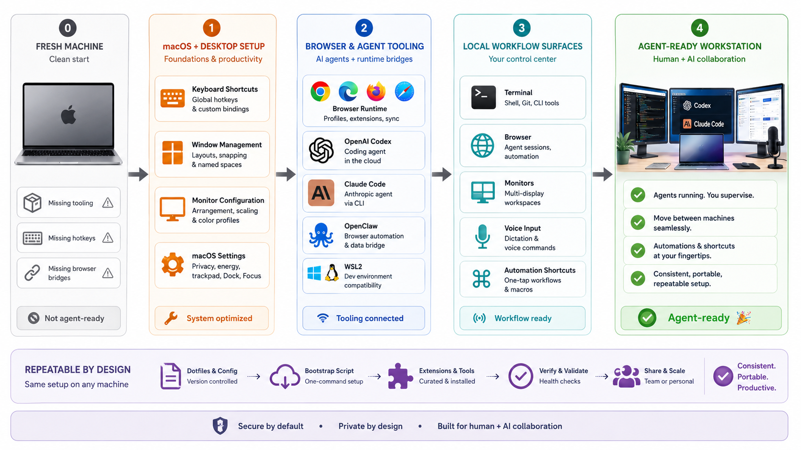

# AgentDesk



Make any machine ready for human and AI-agent work.

AgentDesk packages repeatable setup skills for the local workstation layer: WSL2, macOS, browsers, monitors, Codex, Claude Code, OpenClaw, Bitwarden-backed personal profiles, and the small repair workflows that make agents useful on a real machine.

The repo exists so a fresh or broken workstation can be brought back to a productive, agent-ready state without reconstructing setup knowledge from memory.

## What It Helps With

- Configure macOS window management, dictation, monitors, and daily-driver productivity settings.
- Set up WSL2 browser bridges and agent-browser runtimes.
- Repair OpenClaw and browser-control workflows.
- Keep personal form-fill profile data outside Git while making it usable by agents.
- Install the same workstation skills across Codex and Claude Code.

## Install With skills.sh

List the skills in this repo:

```bash
npx skills add https://github.com/ArthurZakirov/AgentDesk --list
```

Install all skills for Codex on a machine:

```bash
npx skills add https://github.com/ArthurZakirov/AgentDesk --skill '*' -a codex -g -y
```

Install one specific skill:

```bash
npx skills add https://github.com/ArthurZakirov/AgentDesk --skill wsl2-browser-setup -a codex -g -y
```

## Published workstation example

Arthur's complete published monitor, computer, cable, adapter, KVM, audio, and peripheral topology ships inside the single `dell-monitor-kvm-setup` skill package. It is a public-safe, evidence-labelled real-world example and requires no sidecar or runtime link.

Edit skill sources in the repository and refresh installed skills after committing. Treat `npx skills` copies as generated installations.

## Shared skills across harnesses

```bash
npx skills add ArthurZakirov/AgentDesk --skill '*' -a codex claude-code opencode -g -y
```

Codex and OpenCode discover the generated `~/.agents/skills` tree directly; Claude Code uses aliases to that same tree. Keep repository `skills/` as the editing source. Global personal rules are generated from `global-guidance/` into each product's supported location; for Codex that is `$CODEX_HOME/AGENTS.md` (default `~/.codex/AGENTS.md`).

For an opt-in, reversible experiment that applies only generated Codex guidance through chezmoi, see the [chezmoi global-guidance pilot](docs/chezmoi-guidance-pilot.md). It does not replace AgentDesk as the editable source or SkillPort's repository, skill, and scheduling responsibilities.

For composing the shared manifest with ordered, separately owned overlays, see [layered global guidance](docs/layered-global-guidance.md).

## ChatGPT product configuration

ChatGPT-specific settings that are manually applied in the product are versioned separately under [`chatgpt/`](chatgpt/). The canonical personalization text is [`chatgpt/personalization-instructions.md`](chatgpt/personalization-instructions.md); it is intentionally separate from generated `AGENTS.md` guidance.

## Install As A Claude Code Plugin

```text
/plugin marketplace add ArthurZakirov/AgentDesk
/plugin install agentdesk@arthur-zakirov
```

Claude Code plugin skills are namespaced by plugin name, for example:

```text
/agentdesk:wsl2-browser-setup
```

## Install As A Codex Plugin

This repo includes Codex plugin packaging:

- repo marketplace metadata at [`.agents/plugins/marketplace.json`](./.agents/plugins/marketplace.json)
- plugin manifest at [`.codex-plugin/plugin.json`](./.codex-plugin/plugin.json)

Add the marketplace:

```bash
codex plugin marketplace add ArthurZakirov/AgentDesk
```

Then install from Codex with `/plugins`.

For local development from a cloned repo:

```bash
./scripts/setup-local-links.sh
```

Existing non-symlink paths are left untouched unless `--force` is used.

To install or refresh the generated global Codex guidance on any macOS/Linux/WSL machine without cloning AgentDesk first:

```bash
curl -fsSL https://raw.githubusercontent.com/ArthurZakirov/AgentDesk/main/scripts/install-global-guidance.sh | sh
```

The installer respects `$CODEX_HOME` (default `~/.codex`), installs the checked-in generated `AGENTS.md` plus `agents-md-references/`, mirrors the canonical guidance sources under `$CODEX_HOME/agentdesk-source/`, rewrites maintenance/source links to those local files for editor navigation, and backs up existing guidance before replacement.

## Included Skills

<!-- BEGIN GENERATED SECTION: skills -->
> Generated from tracked `skills/*/SKILL.md` metadata.

| Skill | Description |
| --- | --- |
| `aerospace-macos-setup` | Install, configure, and debug AeroSpace on macOS. Use when Codex needs to set up AeroSpace with Homebrew, create or repair ~/.aerospace.toml, configure window movement hotkeys for multi-monitor workflows, diagnose Accessibility or server/config problems, or automate binding tests with the AeroSpace CLI. |
| `bedtime-device-guard` | Install, configure, verify, or remove a lightweight Codex bedtime guard on macOS or Windows. Use when prompts should be blocked during a local overnight window without sending schedule checks to the model; this is a Codex defense-in-depth layer, not a substitute for device, network, or emergency-access controls. |
| `bitwarden-browser-aac-login` | Use Bitwarden Agent Access CLI (`aac`) with agent-controlled browser login flows. Use when a user wants an AI agent to log into a website through `aac listen`/`aac run`, approve credentials in Bitwarden Agent Access, fill browser login forms without printing passwords, debug Agent Access browser login pairing, or build a credential-conscious bridge between `aac run` env injection and browser automation. |
| `bitwarden-personal-profile` | Load, validate, and use a user's private personal profile from Bitwarden CLI for form filling, PDF completion, applications, and identity/contact/employment/housing reuse. Use when an agent needs stable personal data backed by Bitwarden, language-aware profile values, a bundled schema for personal facts, or a safe workflow that materializes real profile values outside Git. |
| `codex-history` | Access OpenAI Codex CLI conversation history to continue work started in Codex, or to find a past Codex chat by topic or keyword. Use when the user says "codex history", "continue from codex", "what was I doing in codex", "pick up from codex", "codex session", "find the codex chat about X", or wants to resume or locate a task that was started in Codex CLI. |
| `codex-windows-clipboard-screenshots` | Recover pasted screenshot images in Windows Codex Desktop when the message says a C:\Users\...\Temp\codex-clipboard-*.png file could not be read. |
| `cross-device-agent-ecosystem` | Route work across Arthur's private Mac, Windows/WSL, and Android agent environments. Use when choosing between ChatGPT Remote, raw SSH, app SSH projects, Computer Use, Logitech Flow, or SkillPort synchronization, or when diagnosing cross-device behavior; not for detailed monitor cabling. |
| `dell-monitor-kvm-setup` | Recall and troubleshoot Arthur's documented Dell U3225QE multi-computer hub, KVM, DisplayLink, audio, and peripheral topology. Use for Arthur's setup or when someone explicitly asks about this published workstation; do not assume the same wiring for other Dell desks. |
| `hammerspoon-macos-setup` | Install, configure, repair, and verify Hammerspoon on macOS for keyboard-driven multi-monitor window placement, Spaces controls, Chrome search scopes, and Claude desktop controls. Use when reproducing this setup, fixing silent Hammerspoon hotkeys, or testing window movement without relying on AeroSpace. |
| `job-application-operator` | Assist Arthur with human-reviewed job applications using local private profile data, document manifests, browser automation, and strict stop-before-submit rules. |
| `manage-caffeinate` | Turn macOS caffeinate sleep prevention on or off, check its status, or explain the launchd-backed setup. Use when the user says to enable, disable, start, stop, toggle, inspect, or troubleshoot caffeinate / coffee Nate / keep-awake behavior for local terminal, Codex, Claude Code, or other agent workflows. |
| `openclaw-browser-setup` | Troubleshoot and operate OpenClaw browser on local or remote gateways. Use when Codex needs to enable the bundled browser plugin, resolve `pairing required` or device approval errors, choose between the managed `openclaw` profile and the attached `user` profile, handle Linux headless or Chrome CDP startup failures, or prove browser control with `profiles`, `start`, `open`, `snapshot`, and `screenshot`. |
| `personal-task-system` | Manage Arthur's personal productivity system through AI-first task capture, Todoist MCP task updates, lightweight Google Calendar/time-block planning, active-seven triage, emoji/category conventions, and cross-device constraints. Use when Arthur asks to manage personal tasks, life admin, reminders, Todoist, calendar planning, weekly/daily triage, backlog anxiety, or the evolving personal operating system. |
| `phone-link-samsung-control` | Control Arthur's Samsung Galaxy S25 FE through Windows Phone Link using Codex Computer Use. Use when asked to operate, configure, or test the mirrored Samsung phone from the Windows desktop; do not use for ordinary browser-only or Android-advice tasks. |
| `setup-dell-monitors` | Troubleshoot Arthur's Dell P2725DE/P2225D monitor setup, especially DisplayPort daisy chaining, "No DP signal from your device" on the P2225D, Windows Fast Startup or shutdown-related display breakage, and reset/reinstall steps for a Lenovo laptop or Dell desktop tower using original Dell cables. |
| `setup-macbook-productivity` | Configure repeatable macOS productivity settings on a user's MacBook, including voice typing / Dictation and Raycast-friendly Google Drive and Dell DDPM launching. Use when Codex is asked to set up, repair, or document MacBook productivity features such as Dictation, shortcuts, microphone input, Google Drive for Desktop, Dell Display and Peripheral Manager (DDPM/DDM), Raycast launch behavior, or similar local macOS workflow preferences. |
| `windows-macos-input-setup` | Configure and verify a Windows 11 PC for macOS-like Logitech keyboard shortcuts, virtual-desktop switching, cross-monitor window movement, and natural scrolling. Use for reproducing or repairing this specific setup without stacking conflicting remappers. |
| `wsl2-browser-setup` | Set up and troubleshoot browser access from WSL2: native Linux Chrome, a Windows Chrome or Edge CDP bridge, or `agent-browser` on either path. Use for WSL browsing, sign-in, CDP connectivity, and `agent-browser` runtime setup; not for browsers outside WSL2. |
<!-- END GENERATED SECTION: skills -->

## Available Commands

<!-- BEGIN GENERATED SECTION: commands -->
> Generated from tracked `commands/*.md` files.

| Command | Summary |
| --- | --- |
| `/list-skills` | Please list all your available skills with a 1 sentence description for each one. Do not return any additional fluff text before or after. |
<!-- END GENERATED SECTION: commands -->

## Repo Inventory

<!-- BEGIN GENERATED SECTION: repo_inventory -->
> Generated from tracked manifests, scripts, commands, and skills.

```text
.
├── .agents/
│   ├── plugins/marketplace.json
│   └── skills -> ../skills
├── .claude-plugin/
│   ├── marketplace.json
│   └── plugin.json
├── .claude/
│   ├── commands -> ../commands
│   └── skills -> ../skills
├── .codex-plugin/
│   └── plugin.json
├── .githooks/
│   └── pre-commit
├── .github/
│   └── workflows/
│       └── readme-generated.yml
├── commands/
│   └── list-skills.md
├── scripts/
│   ├── bootstrap-agents-md.py
│   ├── chezmoi-guidance-pilot.py
│   ├── create-claude-command.sh
│   ├── create-shared-skill.sh
│   ├── generate-readme.py
│   ├── install-git-hooks.sh
│   ├── install-global-guidance.sh
│   ├── regenerate-agents-md.py
│   ├── repository_registry.py
│   ├── setup-local-links.sh
│   └── update-readme.sh
├── skills/
│   ├── aerospace-macos-setup/
│   ├── bedtime-device-guard/
│   ├── bitwarden-browser-aac-login/
│   ├── bitwarden-personal-profile/
│   ├── codex-history/
│   ├── codex-windows-clipboard-screenshots/
│   ├── cross-device-agent-ecosystem/
│   ├── dell-monitor-kvm-setup/
│   ├── hammerspoon-macos-setup/
│   ├── job-application-operator/
│   ├── manage-caffeinate/
│   ├── openclaw-browser-setup/
│   ├── personal-task-system/
│   ├── phone-link-samsung-control/
│   ├── setup-dell-monitors/
│   ├── setup-macbook-productivity/
│   ├── windows-macos-input-setup/
│   └── wsl2-browser-setup/
├── pyproject.toml
└── uv.lock
```
<!-- END GENERATED SECTION: repo_inventory -->

## Development

Use `./scripts/update-readme.sh` after adding or removing tracked skills, commands, scripts, or plugin metadata.
