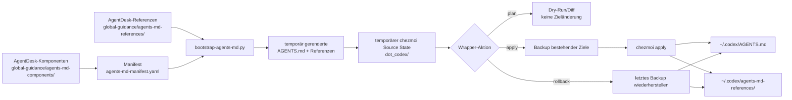

# 🧪 Chezmoi-Pilot für globale Agent-Anweisungen

Dieser Leitfaden erklärt den Pilotversuch ohne vorausgesetzte chezmoi-Kenntnisse. Der wichtigste Satz ist:

> **AgentDesk bleibt die einzige bearbeitbare Quelle. Chezmoi ist im Pilot nur der kontrollierte Kopierer, der fertig erzeugte Dateien in das Codex-Zielverzeichnis schreibt.**

Der Pilot hat das echte Benutzerverzeichnis bisher **nicht** verändert. Der bestätigte Test lief ausschließlich mit einem temporären Test-Home. Ein nativer Windows-Test steht noch aus.

## 🎯 Welches Problem löst chezmoi hier?

AgentDesk kann aus vielen kleinen Markdown-Quellen eine fertige globale `AGENTS.md` und ihre Referenzdateien erzeugen. Offen war die Frage, wie diese fertigen Dateien sicher und nachvollziehbar auf mehrere Geräte gelangen.

Chezmoi hilft in diesem Pilot bei genau einem Schritt:

1. Es erhält einen temporären Ordner mit dem gewünschten Endzustand.
2. Es zeigt zuerst, welche Dateien es ändern würde.
3. Es kopiert die freigegebenen Dateien an den vorgesehenen Ort.
4. Der AgentDesk-Wrapper legt vorher eine Rücksicherung an und kann sie wiederherstellen.

Chezmoi übernimmt hier **nicht**:

- das Bearbeiten der eigentlichen Regeln;
- das Zusammenbauen der `AGENTS.md`;
- `git pull`, Repository-Aktualisierungen oder GitHub-Synchronisierung;
- das Installieren von Skills;
- Zeitplanung oder automatische Hintergrundläufe;
- Claude-Code- oder OpenCode-Konfiguration;
- die Speicherung von Geheimnissen.

## 🧠 Das mentale Modell

Es gibt drei Zustände:

1. **Bearbeitbare Quellen:** kleine Dateien im AgentDesk-Repository.
2. **Gewünschter Zustand:** fertig erzeugte Dateien in einem kurzlebigen chezmoi-Ordner.
3. **Tatsächlicher Zustand:** Dateien unter `~/.codex/` auf dem jeweiligen Gerät.

Chezmoi vergleicht Zustand 2 mit Zustand 3. `plan` zeigt den Unterschied; `apply` gleicht Zustand 3 an Zustand 2 an.

### Rollen und klare Eigentümerschaft

| Baustein | Aufgabe | Darf die Regeln bearbeiten? | Darf das Ziel schreiben? |
| --- | --- | --- | --- |
| **AgentDesk** | Enthält Komponenten, Manifest, Referenzen und Generator | Ja — **einzige Source of Truth** | Der Pilot-Wrapper bereitet die Übergabe vor |
| **Git und GitHub** | Versionieren und transportieren das AgentDesk-Repository zwischen Geräten | Transportieren nur Commits | Nein |
| **SkillPort** | Soll Repositories und Skills geräteübergreifend aktualisieren und Jobs planen | Nein | Im bestehenden Entwurf ja; für einen Rollout muss diese Verantwortung eindeutig geklärt werden |
| **chezmoi** | Vergleicht temporären gewünschten Zustand mit dem Geräte-Ziel und wendet ihn an | Nein | Ja — im Pilot der vorgesehene **Apply Owner** |
| **`~/.codex/`** | Enthält die von Codex gelesenen, generierten Dateien | Nein | Nur der gewählte Apply Owner |

Für einen produktiven Rollout gilt daher:

- **Eine Source of Truth:** AgentDesk.
- **Ein Writer/Apply Owner:** entweder chezmoi oder SkillPorts direkter Generator-Aufruf, niemals beide gleichzeitig.

## 🔄 Exakter Datenfluss



Wichtig: Der temporäre chezmoi Source State ist kein zweites Repository und keine neue Quelle der Wahrheit. Der Wrapper löscht ihn nach dem Lauf automatisch.

## 🗂️ Welche Verzeichnisse gibt es wirklich?

### Dauerhaft im Repository

Diese Struktur kann sich ändern. Der folgende Befehl erzeugt die aktuelle Ansicht neu:

```bash
find global-guidance scripts docs -maxdepth 4 -type f \
  \( -name '*.md' -o -name '*.yaml' -o -name 'chezmoi-guidance-pilot.py' -o -name 'bootstrap-agents-md.py' \) \
  | sort
```

Für den Pilot sind daraus diese Pfade wichtig:

```text
AgentDesk/
├── global-guidance/
│   ├── agents-md-manifest.yaml              # Reihenfolge und Hierarchie
│   ├── agents-md-components/                 # bearbeitbare Regelbausteine
│   └── agents-md-references/                 # bearbeitbare Zusatzreferenzen
├── scripts/
│   ├── bootstrap-agents-md.py                # erzeugt fertige Dateien
│   ├── regenerate-agents-md.py               # normaler Generator-Einstieg
│   └── chezmoi-guidance-pilot.py             # sicherer Pilot-Wrapper
├── tests/
│   └── test_chezmoi_guidance_pilot.py        # Plan/Apply/Rollback-Tests
└── docs/
    └── chezmoi-guidance-pilot.md              # dieser Leitfaden
```

Direkte Links: [`agents-md-manifest.yaml`](../global-guidance/agents-md-manifest.yaml), [`agents-md-components/`](../global-guidance/agents-md-components/), [`agents-md-references/`](../global-guidance/agents-md-references/), [`bootstrap-agents-md.py`](../scripts/bootstrap-agents-md.py), [`regenerate-agents-md.py`](../scripts/regenerate-agents-md.py), [`chezmoi-guidance-pilot.py`](../scripts/chezmoi-guidance-pilot.py) und [`test_chezmoi_guidance_pilot.py`](../tests/test_chezmoi_guidance_pilot.py).

### Nur während eines Pilotlaufs

Die genaue Erzeugung lässt sich jederzeit aus dem Wrapper ableiten:

```bash
rg -n 'TemporaryDirectory|rendered_codex|destination = source|chezmoi.json|persistentState' \
  scripts/chezmoi-guidance-pilot.py
```

Der zur Laufzeit erzeugte Aufbau ist:

```text
<System-Temp>/agentdesk-chezmoi-source-.../
├── chezmoi.json                    # isolierte temporäre chezmoi-Konfiguration
├── state.boltdb                    # isolierter temporärer chezmoi-Zustand
└── source/
    └── dot_codex/                  # chezmoi-Name für das Ziel .codex/
        ├── AGENTS.md
        └── agents-md-references/
            ├── *.md
            └── *.json
```

Der Generator benutzt davor zusätzlich einen zweiten System-Temp-Ordner mit dem Präfix `agentdesk-guidance-render-`. Beide Temp-Ordner verschwinden nach dem Lauf.

Das dauerhafte Backup wird maschinenlokal bestimmt. Den tatsächlich verwendeten Pfad gibt `apply` aus. Die Herleitung steht in [`default_state_dir()`](../scripts/chezmoi-guidance-pilot.py): bevorzugt `XDG_STATE_HOME`, auf Windows `LOCALAPPDATA`, sonst `<Home>/.local/state/agentdesk-chezmoi-pilot`.

## 🧰 Befehle: Wrapper und rohes chezmoi auseinanderhalten

### Befehle des AgentDesk-Piloten

Diese Befehle gehören zu dieser Architektur:

| Befehl | Liest | Ändert | Einordnung |
| --- | --- | --- | --- |
| `uv run python scripts/chezmoi-guidance-pilot.py plan` | AgentDesk-Quellen und aktuelles Codex-Ziel | Nur System-Temp | Sicherer Einstieg; Ziel bleibt unverändert |
| `uv run python scripts/chezmoi-guidance-pilot.py apply` | Quellen und Ziel | Generierte Ziele; vorher Backup | Schreibend; blockiert fremde bestehende Dateien |
| `uv run python scripts/chezmoi-guidance-pilot.py apply --replace-existing` | Quellen und Ziel | Darf nach Vorschau auch fremde bestehende Zieldateien ersetzen | Nur nach menschlicher Prüfung |
| `uv run python scripts/chezmoi-guidance-pilot.py rollback` | Letztes Pilot-Backup | Stellt den Zustand vor dem letzten Apply wieder her | Schreibend, aber auf exakt verwaltete Ziele begrenzt |

`apply` führt intern immer zuerst denselben Dry-Run wie `plan` aus. Bei Konflikten beendet chezmoi den Lauf durch `--error-on-conflict=true`, statt automatisch eine Antwort auszuwählen.

### Allgemeine chezmoi-Befehle

Diese Tabelle erklärt chezmoi selbst. Viele Befehle werden vom Pilot **absichtlich nicht direkt verwendet**, weil dessen Source State kurzlebig ist.

| Roher Befehl | Bedeutung | Ändert etwas? | Rolle in diesem Pilot |
| --- | --- | --- | --- |
| `chezmoi init [repo]` | Erstellt oder klont einen dauerhaften Source State; `--apply` würde zusätzlich Ziele schreiben | Ja | **Nicht verwenden**; AgentDesk ist bereits die Quelle |
| `chezmoi source-path` | Zeigt den Pfad des dauerhaften Source State | Nein | Beim Pilot kaum nützlich, weil der Wrapper einen Temp-Pfad vorgibt |
| `chezmoi status` | Zeigt Drift zwischen letztem, tatsächlichem und gewünschtem Zustand | Nein | Konzeptuell nützlich, aber der Pilot verwirft seinen chezmoi-Zustand nach jedem Lauf |
| `chezmoi diff` | Zeigt den Unterschied zwischen gewünschtem und tatsächlichem Zustand | Nein | Entspricht dem Kern von `plan`; der Wrapper nutzt den ausführlichen Apply-Dry-Run |
| `chezmoi apply --dry-run --verbose` | Simuliert Apply und zeigt Details | Nein | Wird vom Wrapper intern ausgeführt |
| `chezmoi apply` | Bringt Ziele in den gewünschten Zustand | Ja | Wird nur durch den Wrapper nach Backup und Schutzprüfung ausgeführt |
| `chezmoi update` | Holt das Git-Repository des dauerhaften chezmoi Source State und führt Apply aus | Ja | **Nicht verwenden**; Git/SkillPort aktualisieren AgentDesk getrennt |
| `chezmoi add <ziel>` | Kopiert eine bestehende Zieldatei in einen dauerhaften Source State | Ja, im Source State | **Nicht verwenden**; würde eine konkurrierende bearbeitbare Kopie erzeugen |
| `chezmoi edit <ziel>` | Bearbeitet die Source-State-Datei | Ja, im Source State | **Nicht verwenden**; Regeln werden in AgentDesk bearbeitet |
| `chezmoi doctor` | Prüft Installation und häufige Konfigurationsprobleme | Normalerweise nein | Sinnvolle Installationsprüfung vor dem Pilot |

Offizielle Details: [`init`](https://www.chezmoi.io/reference/commands/init/), [`source-path`](https://www.chezmoi.io/reference/commands/source-path/), [`status`](https://www.chezmoi.io/reference/commands/status/), [`diff`](https://www.chezmoi.io/reference/commands/diff/), [`apply`](https://www.chezmoi.io/reference/commands/apply/), [`update`](https://www.chezmoi.io/user-guide/command-overview/), [`add`](https://www.chezmoi.io/reference/commands/add/), [`edit`](https://www.chezmoi.io/reference/commands/edit/) und [globale Flags](https://www.chezmoi.io/reference/command-line-flags/global/).

## 🧭 Drei konkrete Abläufe

### 1. Erster sicherer lokaler Test auf macOS

Dieser Ablauf berührt nicht das echte Home:

1. Prüfe, ob chezmoi verfügbar ist:

   ```bash
   chezmoi doctor
   ```

2. Erzeuge ein temporäres Home und führe nur `plan` aus:

   ```bash
   pilot_home="$(mktemp -d)"
   uv run python scripts/chezmoi-guidance-pilot.py plan \
     --home "$pilot_home" \
     --state-dir "$pilot_home/state"
   ```

3. Optional: Wende die Dateien ausschließlich im Temp-Home an:

   ```bash
   uv run python scripts/chezmoi-guidance-pilot.py apply \
     --home "$pilot_home" \
     --state-dir "$pilot_home/state"
   test -f "$pilot_home/.codex/AGENTS.md"
   test -f "$pilot_home/.codex/agents-md-references/codex.md"
   ```

4. Teste die Rücksicherung:

   ```bash
   uv run python scripts/chezmoi-guidance-pilot.py rollback \
     --home "$pilot_home" \
     --state-dir "$pilot_home/state"
   test ! -e "$pilot_home/.codex/AGENTS.md"
   ```

Der bereits durchgeführte echte chezmoi-Test auf macOS nutzte genau dieses Prinzip: temporäres Home, Apply, Dateiprüfung und Rollback. Er war erfolgreich; diese Aussage kann durch erneutes Ausführen der obigen Schritte aktualisiert werden.

### 2. Normales Update nach einer AgentDesk-Änderung

1. Bearbeite die passende Datei unter [`global-guidance/agents-md-components/`](../global-guidance/agents-md-components/) oder [`global-guidance/agents-md-references/`](../global-guidance/agents-md-references/).
2. Prüfe und committe die AgentDesk-Änderung nach dem normalen Repository-Workflow.
3. Aktualisiere auf dem Zielgerät den AgentDesk-Checkout mit Git beziehungsweise später über den reparierten SkillPort-Refresh.
4. Zeige zuerst die geplanten Zieländerungen:

   ```bash
   uv run python scripts/chezmoi-guidance-pilot.py plan
   ```

5. Wenn die Vorschau korrekt ist, wende sie an:

   ```bash
   uv run python scripts/chezmoi-guidance-pilot.py apply
   ```

6. Falls bereits eine nicht vom AgentDesk-Generator markierte Zieldatei existiert, stoppt der Wrapper. Vergleiche und sichere deren Inhalt menschlich. Verwende erst danach bewusst:

   ```bash
   uv run python scripts/chezmoi-guidance-pilot.py apply --replace-existing
   ```

### 3. Rollback und Wiederherstellung

1. Wenn ein Pilot-Apply ein unerwünschtes Ergebnis erzeugt hat, führe aus:

   ```bash
   uv run python scripts/chezmoi-guidance-pilot.py rollback
   ```

2. Der Wrapper wählt das neueste Backup unter seinem maschinenlokalen Statusordner.
3. Er stellt vorher vorhandene Dateien oder Symlinks wieder her.
4. Er entfernt nur Pilot-Ziele, die vor diesem Apply nicht existierten. Fremde Dateien im Referenzordner bleiben erhalten.

Verwende dafür nicht `chezmoi destroy`: Der offizielle Befehl löscht Quelle und Ziel dauerhaft und gehört nicht zum Pilot-Workflow.

### Windows-Hinweis

Der Wrapper akzeptiert ein Windows-Home und verlangt, dass das Codex-Ziel ein direkter Unterordner davon ist:

```powershell
uv run python scripts/chezmoi-guidance-pilot.py plan `
  --home $env:USERPROFILE `
  --codex-home (Join-Path $env:USERPROFILE '.codex')
```

Die Pfadlogik und das fail-closed Verhalten sind automatisiert getestet. Ein vollständiger Lauf mit echtem chezmoi auf **nativem Windows ist noch nicht durchgeführt**. Vor einem produktiven Windows-Rollout müssen dort `plan`, Temp-Home-`apply` und `rollback` beobachtet werden.

## 🔗 Warum nicht nur Git Clone, Git Pull und ein Symlink?

Ein Symlink könnte `~/.codex/AGENTS.md` direkt auf eine Datei im Repository zeigen. Das ist einfacher, wenn alle folgenden Bedingungen gelten:

- genau eine fertige Datei reicht aus;
- ihr Inhalt ist auf allen Geräten identisch;
- der Repository-Pfad ist stabil;
- Codex und das Betriebssystem folgen Symlinks zuverlässig;
- es werden keine generierten Begleitdateien, Vorschau, Konfliktschutz oder Rücksicherung benötigt.

Der aktuelle Fall ist anders:

- Die fertige `AGENTS.md` entsteht aus Manifest und mehreren Komponenten.
- Ein ganzer Referenzordner gehört zum Ergebnis.
- Absolute oder relative Links müssen für das Zielgerät korrekt erzeugt werden.
- Ein erster Austausch vorhandener Regeln soll blockieren oder bewusst bestätigt werden.
- Vor einer Änderung soll eine sichtbare Vorschau stehen.
- Ein Rollback soll den vorherigen Zustand wiederherstellen.

Ein Git-Checkout plus Symlink transportiert nur einen Pfad. Er modelliert weder den erzeugten Zielzustand noch Backup, Konfliktprüfung oder geräteabhängige Anwendung. Für eine kleine, identische und bereits fertige Konfigurationsdatei wäre er jedoch wahrscheinlich ausreichend und leichter zu betreiben.

## 🛡️ Sicherheit und Grenzen

- `plan` schreibt nicht in das Ziel.
- `apply` zeigt immer zuerst denselben Dry-Run.
- Unverwaltete bestehende Regeln blockieren ohne `--replace-existing`.
- Vor dem Schreiben werden vorhandene Pilot-Ziele gesichert.
- Maschinenpfade und Secret-Provider-Konfiguration bleiben lokal und gehören nicht ins Repository.
- Der temporäre Source State enthält nur die aus AgentDesk erzeugte Anleitung.
- Das echte Benutzer-Home wurde während Entwicklung und Verifikation dieses Piloten nicht verändert.

## 🐛 Separater bestätigter SkillPort-Defekt

Der Defekt lässt sich gegen benachbarte Checkouts reproduzieren:

```bash
rg -n -- '--common|--overlay|--platform|global-guidance/(common|macos|windows-wsl)\.md' \
  ../SkillPort/scripts
uv run python scripts/bootstrap-agents-md.py --help
```

SkillPorts macOS- und Windows-Refresh-Skripte verwenden noch die entfernten Optionen `--common`, `--overlay` und `--platform` sowie nicht mehr vorhandene flache Guidance-Dateien. AgentDesk verwendet jetzt das Manifest über [`regenerate-agents-md.py`](../scripts/regenerate-agents-md.py).

Dieser Defekt ist bestätigt, aber **nicht Teil dieses Dokumentationsauftrags und wurde hier nicht repariert**. Vor einem unbeaufsichtigten Rollout muss SkillPort separat angepasst werden.

## ▶️ Was soll ich jetzt tun?

Der kleinste sinnvolle nächste Schritt ist nur eine Vorschau in einem temporären Home:

```bash
pilot_home="$(mktemp -d)"
uv run python scripts/chezmoi-guidance-pilot.py plan \
  --home "$pilot_home" \
  --state-dir "$pilot_home/state"
```

Danach noch nichts live anwenden. Prüfe zuerst, ob Ausgabe, Zieldateien und Verantwortungsmodell verständlich sind. Die nächste Entscheidung ist anschließend: Soll chezmoi dauerhaft der einzige Apply Owner werden, oder soll SkillPort nach seiner Reparatur wieder direkt schreiben?

## 📖 Glossar

| Begriff | Einfache Bedeutung in diesem Pilot |
| --- | --- |
| **Source State** | Der gewünschte Inhalt in chezmois Quellformat. Hier ist er temporär und wird bei jedem Wrapper-Lauf aus AgentDesk neu erzeugt. |
| **Target State** | Der von chezmoi berechnete Sollzustand für `~/.codex/`. |
| **Destination/Ziel** | Der tatsächliche Ordner auf dem Gerät, standardmäßig `~/.codex/`. |
| **Template** | Eine Quelldatei mit Platzhaltern oder Bedingungen für unterschiedliche Geräte. Der Pilot nutzt derzeit keine eigenen Secret- oder Geräte-Templates; er erzeugt fertige Dateien. |
| **Apply** | Der Schreibvorgang, der das Ziel an den berechneten Sollzustand angleicht. |
| **Drift** | Unterschied zwischen gewünschtem Zustand und den Dateien, die gerade wirklich auf dem Gerät liegen. |

## ✅ Verifikation und offizielle Quellen

Repository-Prüfungen lassen sich reproduzieren mit:

```bash
uv run pytest -q
git diff --check
```

Die Pilot-Tests erzeugen temporäre Homes und prüfen zielrelative Links, einen blockierten Erstlauf, Apply, Rollback sowie den Erhalt fremder Referenzdateien. Sie verändern kein Live-Home.

Offizielle chezmoi-Grundlagen:

- [Konzepte: Source, Destination und Target State](https://www.chezmoi.io/reference/concepts/)
- [Quick Start und geräteübergreifender Ablauf](https://www.chezmoi.io/quick-start/)
- [Globale Flags: Source, Destination, Dry-Run und Konfliktverhalten](https://www.chezmoi.io/reference/command-line-flags/global/)
- [`apply`](https://www.chezmoi.io/reference/commands/apply/)
- [`diff`](https://www.chezmoi.io/reference/commands/diff/)
- [Geräteunterschiede und Templates](https://www.chezmoi.io/user-guide/manage-machine-to-machine-differences/)
- [Warnung zu `destroy`](https://www.chezmoi.io/reference/commands/destroy/)
